# Wild Guard

Wild Guard is a mobile app for reporting and following wildlife warnings. It helps field users see nearby wildlife activity, submit warning reports with location context, review alert details, coordinate through feedback, and ask an AI chatbot wildlife-related safety questions.

## What works now

- Account sign up and login with email or phone credentials.
- Nearby wildlife warnings and a separate list for reports submitted by the current user.
- Current-location lookup with distance shown on alert cards.
- Dynamic warning submission form powered by the configured KoboToolbox form.
- Alert detail pages with severity, species, location, report metadata, and attached evidence when available.
- Warning feedback threads so users can reply to a report.
- AI wildlife chatbot for safety questions, animal signs, warning context, and park guidance.

## Screenshots

### Alerts and feedback

| Alerts list | New warning | Warning feedback |
| --- | --- | --- |
| 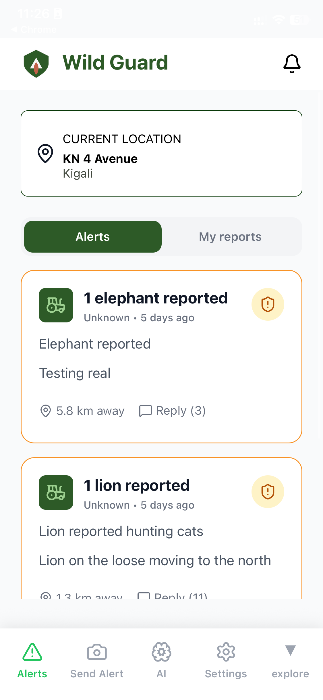 | 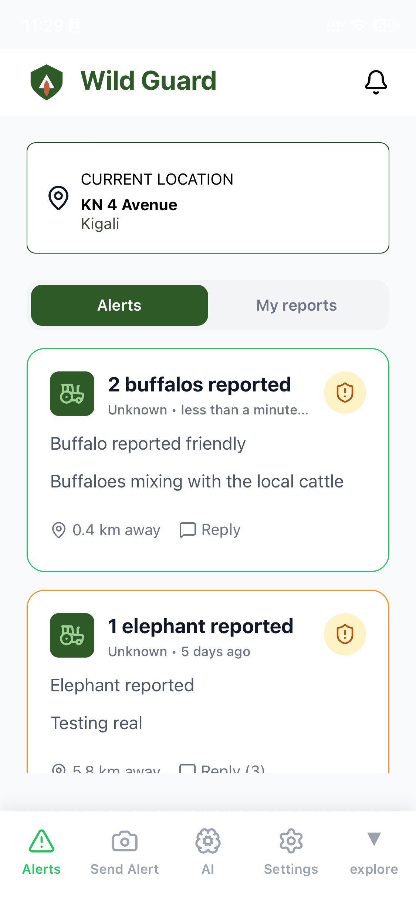 | 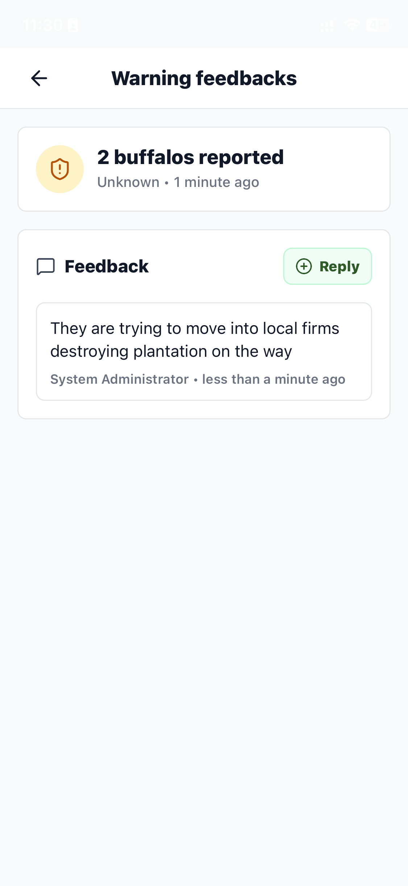 |

### Warning reports

| Species | Evidence | Urgency |
| --- | --- | --- |
| 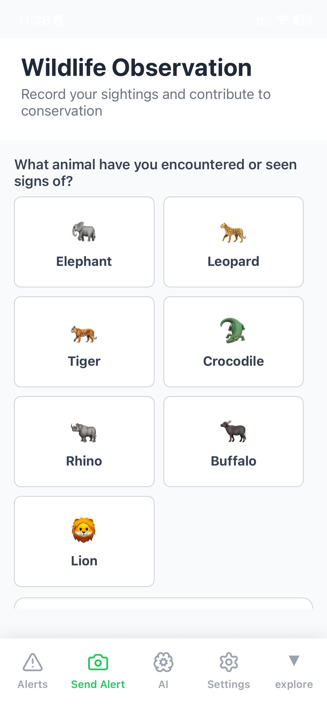 | 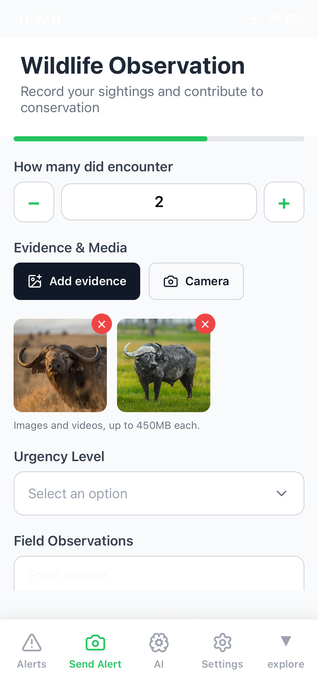 | 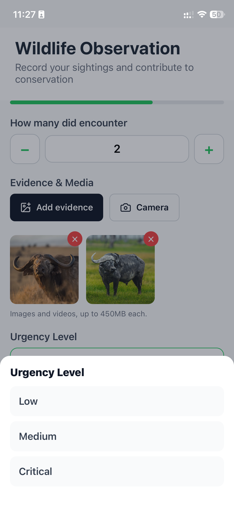 |

| Location | Additional details |
| --- | --- |
| 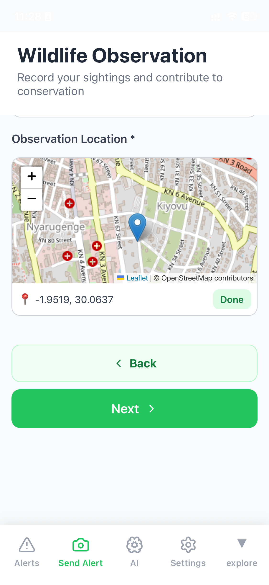 | 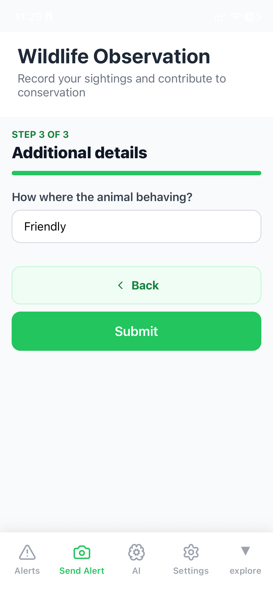 |

### Wildlife AI

| Assistant start | Assistant answer |
| --- | --- |
| 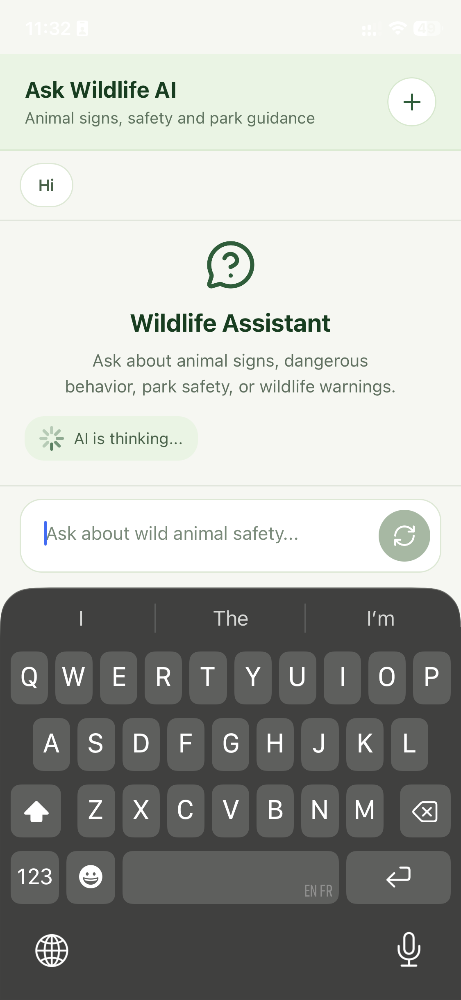 | 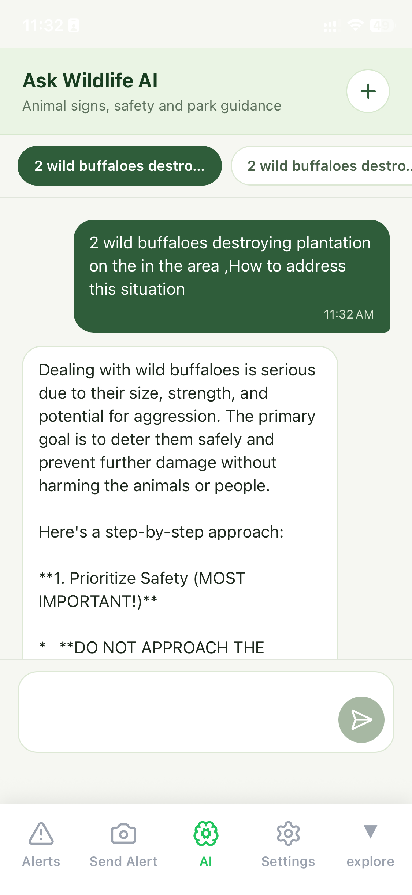 |

### Authentication

| Welcome | Sign up | Create account | Login |
| --- | --- | --- | --- |
| 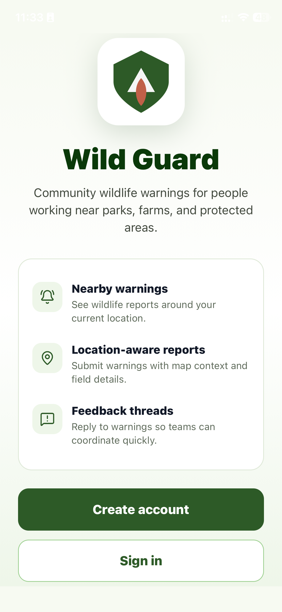 | 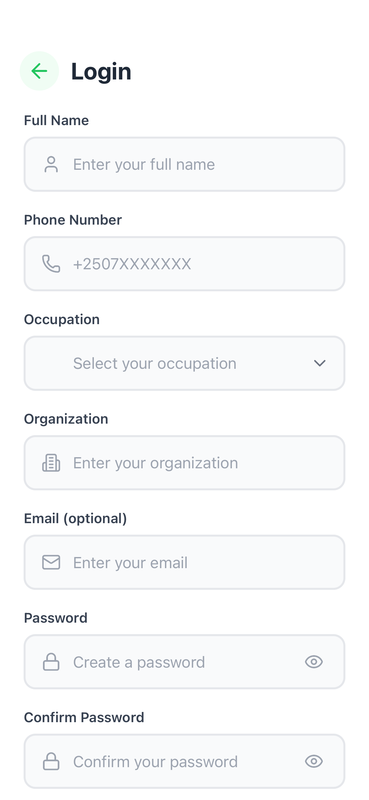 | 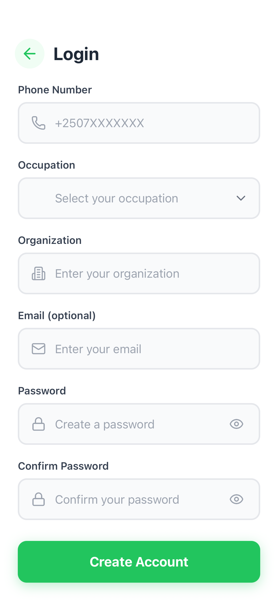 | 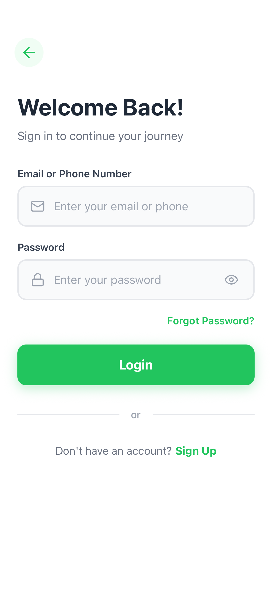 |

## Tech stack

- Expo 54 and React Native 0.81
- Expo Router for file-based navigation
- TanStack Query for API state
- KoboToolbox form integration
- Expo Location, Notifications, Secure Store, and Image Picker

## Getting started

Install dependencies:

```bash
npm install
```

Start the Expo development server:

```bash
npm run start
```

Then open the app in a development build, Android emulator, iOS simulator, or Expo Go from the Expo CLI prompt.

## Useful scripts

```bash
npm run android
npm run ios
npm run web
npm run lint
```

## Project notes

- App routes live under `app/`.
- Shared UI components live under `components/`.
- API and data-normalization code lives under `services/`.
- Native capability helpers and storage utilities live under `utils/`.
